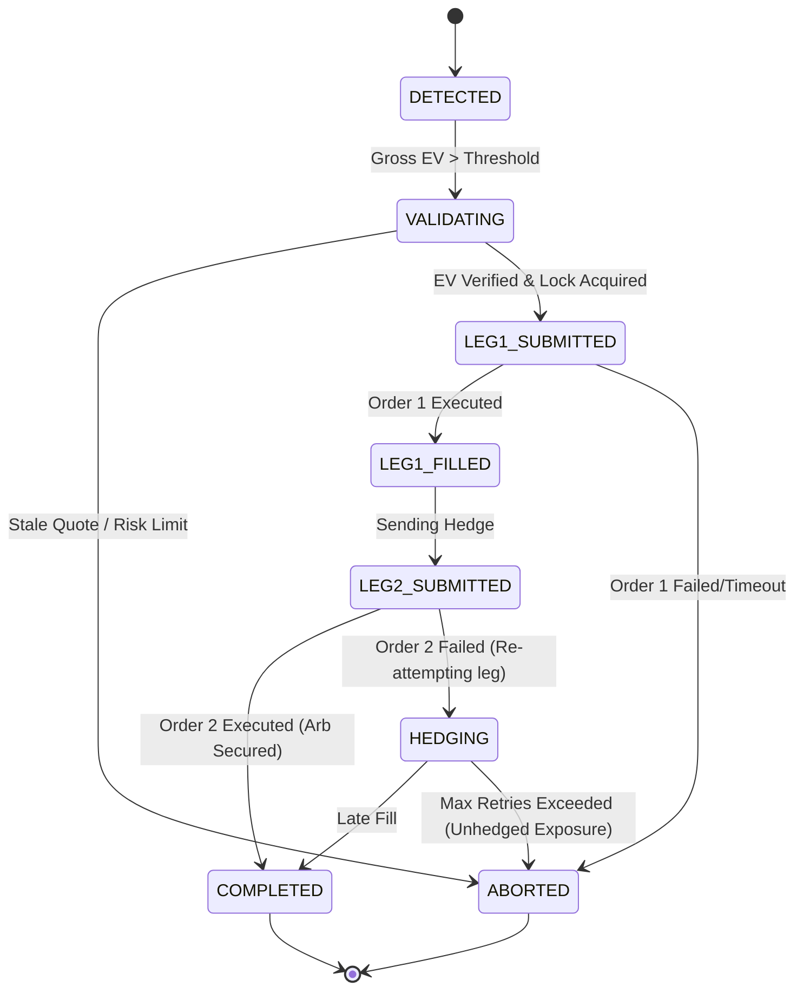

# 📈 Kalshi ↔ Polymarket Cross-Exchange Arbitrage Engine


An institutional-grade, low-latency cross-exchange arbitrage execution engine trading binary outcome markets between Polymarket US (CFTC-regulated) and Kalshi.

## 📌 Project Overview

- **Primary Market**: 15-minute Bitcoin Up/Down recurring markets
  - Kalshi: `KXBTC15M`
  - Polymarket US: `cpc-btc-updown-15m-*`
- **Core Mechanism**: Buy **YES** on one exchange and simultaneously Buy **NO** on the other. Because these are binary mutually exclusive contracts, exactly one will settle at $1.00 and the other at $0.00. If the combined gross cost of the positions is strictly less than $1.00, the difference is a guaranteed, risk-free profit.
- **Latency Optimization**: Designed to be deployed on AWS EC2 `us-east-1` (North Virginia) to achieve sub-2ms network latency to both exchange APIs.

---

## 🚀 Quick Start

### 1. Prerequisites
- Python 3.11+
- API keys for Polymarket US and Kalshi
- Generated RSA private key for Kalshi API v2 authentication

### 2. Installation
```bash
git clone <repository_url>
cd Kalshi_ARB
python -m venv venv
source venv/bin/activate  # Or `venv\Scripts\activate` on Windows
pip install -r requirements.txt
```

### 3. Configuration
Copy the environment template and populate your keys:
```bash
cp .env.example .env
```
Update your secrets in `.env` and adjust risk limits/fees in `config/config.yaml`.

### 4. Running the Engine
By default, the engine runs safely in paper trading mode.
```bash
# Paper trading (safe)
python main.py
```

---

## 💻 CLI Usage

```bash
# Paper trading (default - safe):
python main.py

# Paper trading with real-time dashboard:
python main.py --dashboard --dashboard-port 8000

# Single scan cycle (useful for cron or testing):
python main.py --scan-once

# LIVE trading (requires explicit confirmation):
python main.py --live --confirm-live-risk --dashboard
```

---

## 📐 Architecture

```text
Kalshi_POLY_ARB/
├── config/
│   ├── config.yaml            # All tunable parameters (fees, risk limits, thresholds)
│   └── kalshi_key.pem         # RSA private key for Kalshi auth (gitignored)
├── deploy/
│   ├── setup_ec2.sh           # One-command EC2 provisioning script
│   ├── kalshi-arb.service     # systemd unit file for auto-restart
│   └── start_tunnel.bat       # Windows SSH tunnel helper for dashboard access
├── src/
│   ├── models.py              # All domain types: Platform, OrderBook, Market, Opportunity
│   ├── config.py              # Pydantic config loader from YAML + .env
│   ├── bot.py                 # Main orchestrator: discovery → matching → evaluation → execution loop
│   ├── clients/
│   │   ├── kalshi_client.py   # Kalshi v2 REST: RSA-SHA256-PSS auth, orderbook, order placement
│   │   └── polymarket_client.py # Polymarket Gamma + CLOB: market discovery, orderbook, orders
│   ├── math/
│   │   ├── ev_calculator.py   # Conservative net EV computation with friction modeling
│   │   └── fee_calculator.py  # Kalshi quadratic taker fees, Polymarket fee model
│   ├── matcher/
│   │   └── market_matcher.py  # Cross-exchange market pairing (strike, date, outcome alignment)
│   ├── execution/
│   │   ├── risk_manager.py    # Pair locking, exposure limits, daily loss tracking, kill switch
│   │   ├── leg_risk_fsm.py    # 7-state two-leg execution FSM with partial fill hedging
│   │   └── reconciler.py      # Append-only WAL journal for crash recovery
│   └── dashboard/
│       ├── server.py          # FastAPI + WebSocket real-time dashboard
│       └── state.py           # Thread-safe dashboard state management
├── tests/                     # 28 unit/integration tests
├── main.py                    # CLI entry point
├── requirements.txt           # Python dependencies
└── .env.example               # Credential template (zero secrets)
```

---

## 🧮 Mathematical Expected Value (EV) Formulation

To ensure trade profitability given exchange friction, the engine calculates a conservative Net Expected Value (EV) before triggering execution.

$$
\text{Gross Cost} = P_{1, \text{ask}} + P_{2, \text{ask}}
$$
$$
\text{Gross EV} = \$1.00 - \text{Gross Cost}
$$

The Net EV incorporates exchange fees, estimated slippage, an adverse market buffer, and cost of capital:

$$
\text{Net EV} = Q \times (\text{Gross EV}) - F_{\text{Kalshi}} - F_{\text{Poly}} - S - B_{\text{adverse}} - C_{\text{capital}}
$$

**Execution Threshold:**
The FSM is activated *only* if:
1. $\text{Net EV} > \$0.15$
2. $\text{Net Edge} = \left( \frac{\text{Net EV}}{Q \times \text{Gross Cost}} \right) > 1.5\%$

---

## ⚙️ Execution State Machine (FSM)

The engine coordinates concurrent, cross-exchange partial fills using a deterministic Finite State Machine to mitigate leg-risk.



---

## 🛡️ Risk Controls

Capital preservation is guaranteed via several layers of strictly enforced constraints:
- **Capital Constraints**: Maximum $10.00 allocated per trade, maximum 10 contracts per execution.
- **Daily Loss Limits**: A $5.00 daily loss limit automatically triggers the global kill switch.
- **Circuit Breakers**: 3 consecutive execution failures trigger the global kill switch.
- **Staleness Rejection**: Quotes older than 2.0 seconds are discarded immediately.
- **Order Types**: Exclusively utilizes Immediate-Or-Cancel (IOC) limit orders. Market orders are never used.

---

## 🔧 Configuration

All tuning is managed in `config/config.yaml`.
- **Trading Limits**: `max_contracts`, `max_trade_capital`
- **Fees**: Kalshi quadratic taker fee mapping, Polymarket fee rates
- **Thresholds**: `min_net_ev`, `min_edge_pct`, `quote_timeout_ms`

---

## 📊 Real-Time Dashboard

Includes an embedded FastAPI dashboard for monitoring execution.
- **Real-time Live Updates**: WebSocket integration streams live orderbook disparities and FSM state changes.
- **Resiliency**: Automatically falls back to 1-second HTTP polling if WebSockets fail.
- **Security**: Protected via HTTP Basic Auth.

---

## ☁️ Deployment

For maximum profitability, the engine must be deployed in **AWS `us-east-1` (North Virginia)** to maintain sub-2ms network latency to both Kalshi and Polymarket US APIs.

Use the provided deploy scripts:
```bash
# SSH into EC2 instance
./deploy/setup_ec2.sh
# Start the systemd service
sudo systemctl enable kalshi-arb
sudo systemctl start kalshi-arb
```
Windows users can utilize `deploy/start_tunnel.bat` to securely proxy the remote web dashboard to `localhost`.

---

## 🔐 Security

- **Kalshi Authentication**: Utilizes RSA-SHA256-PSS signed timestamps via API v2.
- **Polymarket US Authentication**: Uses Ed25519 signed requests (`X-PM-Access-Key`, `X-PM-Timestamp`, `X-PM-Signature`). No wallet passphrase or private keys are kept in memory beyond signing context.
- **Credential Safety**: The `.env` file and `config/kalshi_key.pem` are strictly git-ignored. `.env.example` provides zero-secret structural templating.

---

## 🧪 Testing

The system is validated by **28 unit and integration tests** ensuring mathematical correctness and FSM reliability.

```bash
pytest tests/ -v
```
Test coverage spans:
- Expected Value calculation correctness
- Exact fee formulation (quadratic taker)
- Cross-exchange market pair matching
- FSM state transitions & hedging logic
- Network latency simulation & penalty bounds
- Dashboard authentication
