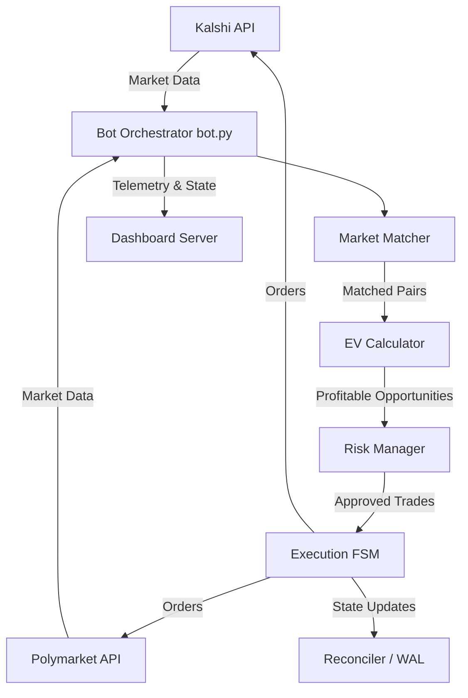
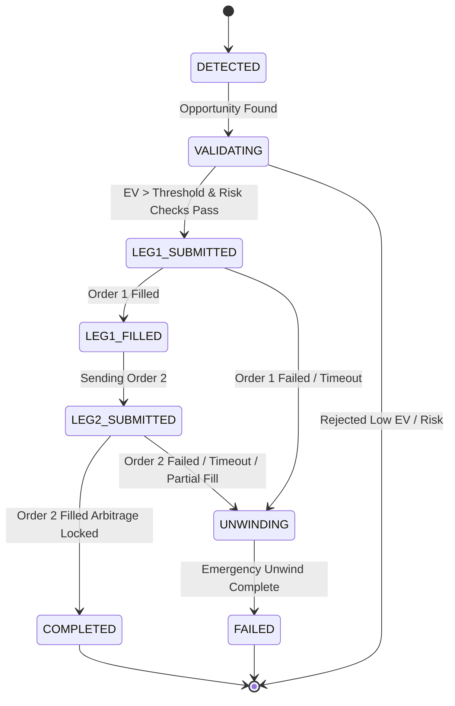

# Kalshi-Polymarket Arbitrage Bot Architecture

## System Overview and Data Flow

The arbitrage bot is designed to discover and execute cross-exchange arbitrage opportunities between Kalshi and Polymarket. It continuously monitors market data, identifies matching contracts, computes expected value (EV) after all costs, and executes trades across both venues using a state machine to manage execution risk.

## Component Responsibilities

The codebase is organized into modular components under the `src/` directory:

1. **`bot.py`**
   - Main orchestrator.
   - Runs a continuous loop: discover markets on both exchanges → match cross-exchange pairs → evaluate each pair for arbitrage → execute if profitable.

2. **`clients/kalshi_client.py`**
   - Kalshi REST API client.
   - Handles RSA-SHA256-PSS authentication, connection pooling, and orderbook fetching.

3. **`clients/polymarket_client.py`**
   - Polymarket API client.
   - Uses Gamma API for market discovery and CLOB API for orderbooks.
   - Currently being migrated to Polymarket US API (Ed25519 authentication).

4. **`matcher/market_matcher.py`**
   - Matches markets across exchanges by strike price, expiry date, and outcome type.
   - Supports a `focus_15m_btc_only` mode that filters specifically for KXBTC15M markets.

5. **`math/ev_calculator.py`**
   - Computes conservative net Expected Value (EV).
   - Accounts for all fees, slippage, adverse execution probabilities, and capital costs.
   - Acts as a hard gate: executes trades only if net EV > threshold.

6. **`math/fee_calculator.py`**
   - Implements exchange-specific fee models.
   - Calculates Kalshi's CFTC quadratic taker fee and the Polymarket fee model.

7. **`execution/risk_manager.py`**
   - Handles pair-level concurrency locks and exposure tracking.
   - Tracks daily P&L and maintains a global kill switch.
   - Enforces position sizing (clamped to $10/10 contracts).

8. **`execution/leg_risk_fsm.py`**
   - Manages the two-leg execution using a robust 7-state machine.
   - Handles partial fills, execution timeouts, and emergency unwinds (hedging).

9. **`execution/reconciler.py`**
   - Maintains an append-only Write-Ahead Log (WAL) for crash recovery.
   - On bot restart, replays the journal to reconstruct state and handle any stranded executions.

10. **`dashboard/server.py`**
    - FastAPI web application.
    - Provides real-time updates via WebSockets and secures access with HTTP Basic Auth.

11. **`dashboard/state.py`**
    - Thread-safe state container.
    - Stores telemetry, active opportunities, and current positions for the dashboard.

## The Arbitrage Strategy

The strategy targets **synthetic complementary bundles** across Kalshi and Polymarket. Since the two exchanges may price identical binary events slightly differently due to local liquidity or participant bias, the bot simultaneously buys "Yes" on one exchange and "No" (or equivalent opposing outcome) on the other. If the combined cost of the two complementary positions is less than $1.00 (the guaranteed payout), an arbitrage profit is locked in, independent of the actual real-world outcome.

## Two-Leg Execution FSM

Because the trades must be placed on two separate exchanges, there is execution risk (one leg fills, the other fails or price moves). The bot manages this using a strict Finite State Machine.

## Risk Management Layers

1. **Pre-Trade (EV & Size):** The EV Calculator aggressively prices in slippage and worst-case execution. Position sizes are strictly clamped (e.g., $10 max).
2. **Execution (FSM):** The 7-state FSM guarantees that failure on one leg triggers an automatic unwind/hedge attempt to minimize directional exposure.
3. **System (Risk Manager):** Tracks cumulative exposure, limits concurrency per pair, monitors daily P&L, and trips a global kill switch if losses exceed thresholds.
4. **Resiliency (Reconciler):** The Write-Ahead Log ensures that if the process crashes mid-execution, it can recover its state and clean up stranded positions upon restart.
